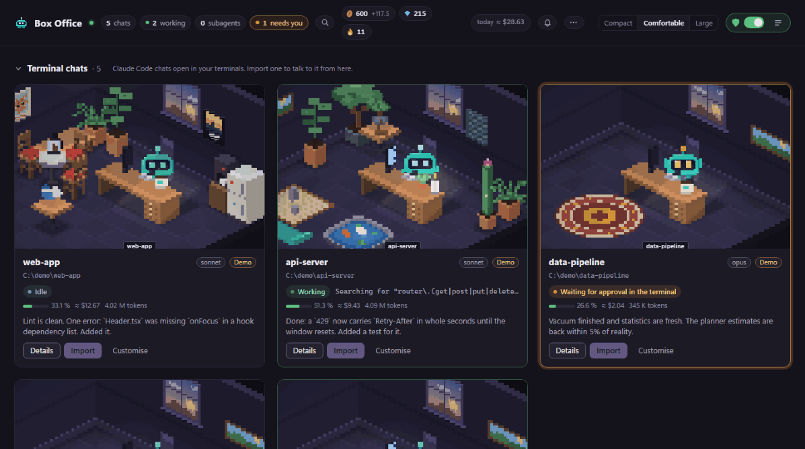
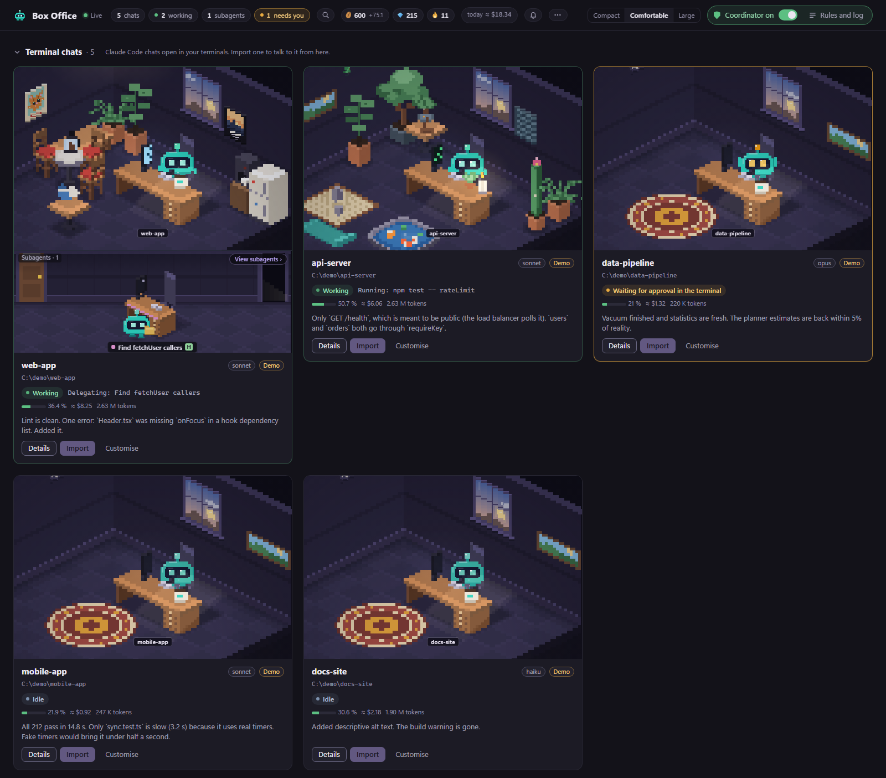
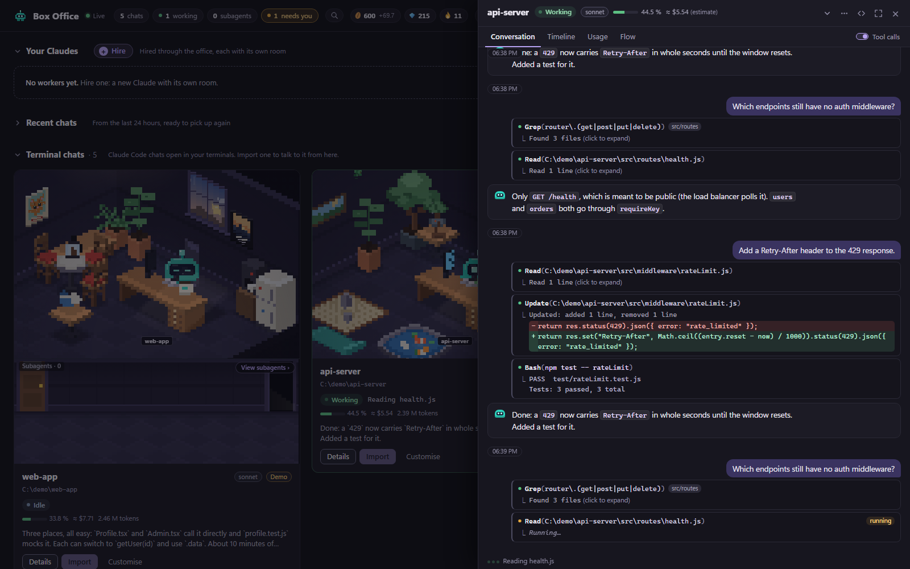
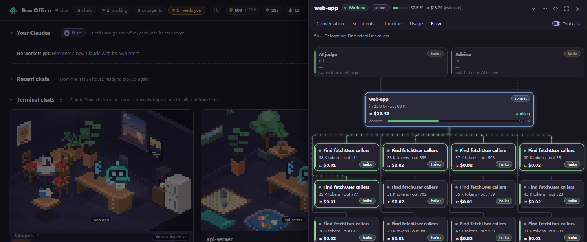
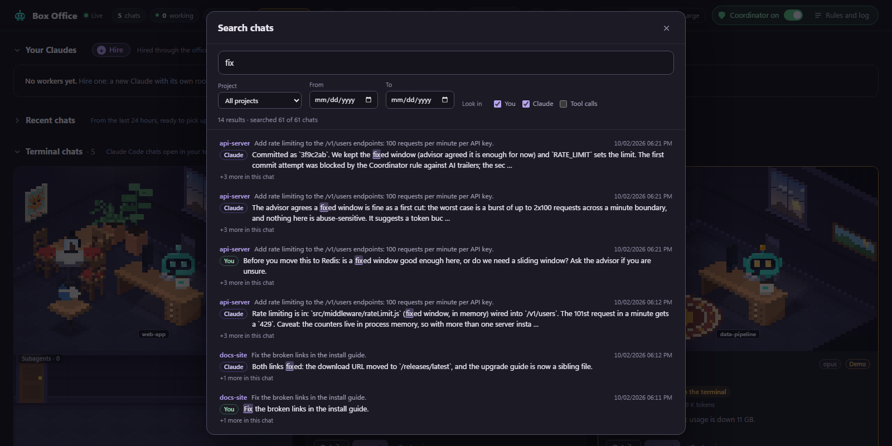
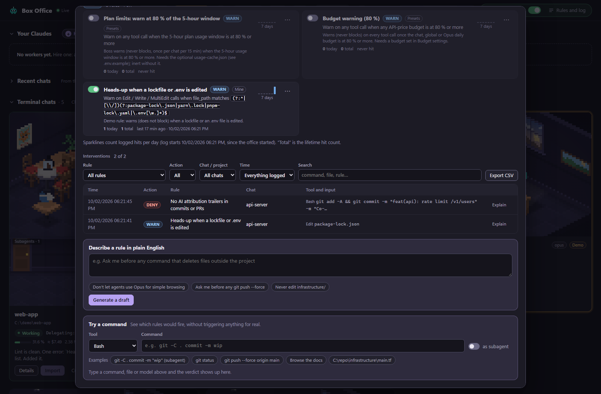
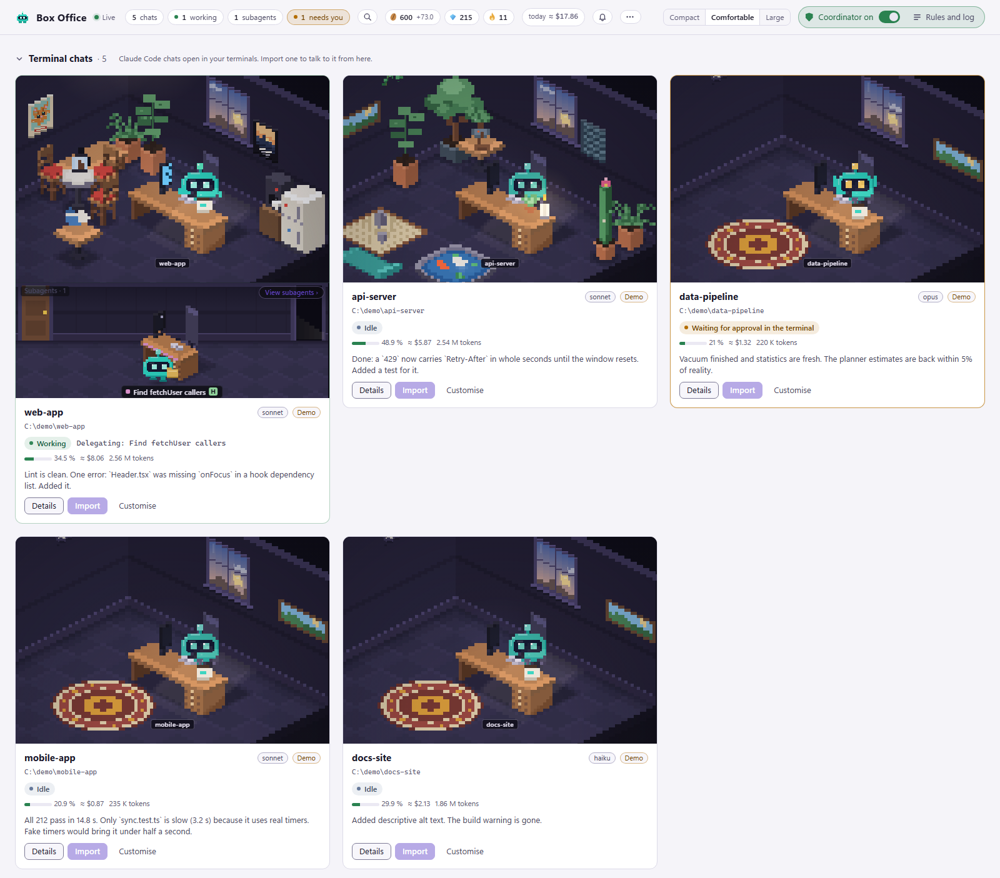
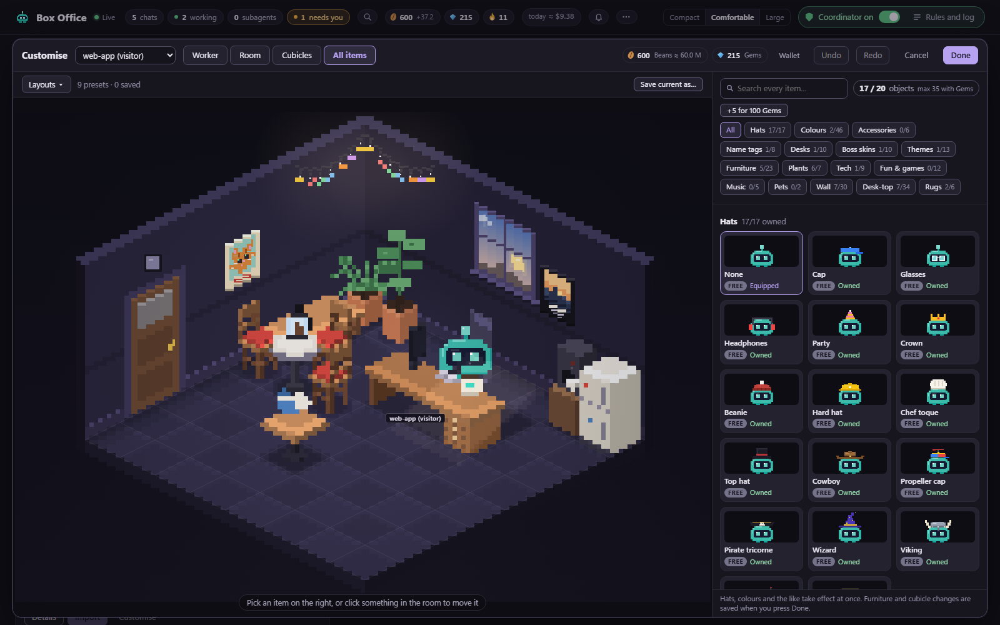

# Box Office

**See every Claude Code session in one pixel-art office: who is working, who is waiting for you, and what it costs.**



- **One room per chat.** A character works, idles or waits for you; subagents show up as a team under the room. Import a chat and talk to it from the browser.
- **Estimated cost and guardrails.** Cost per chat and per day (list prices, not a bill), context use, daily budgets, and a Coordinator: rules that deny, ask or warn before a tool runs. Guardrails, not a sandbox.
- **Local only.** Listens on `127.0.0.1`, no telemetry, zero dependencies, MIT.

[](LICENSE)

[](https://github.com/AntonioGM382/box-office/actions/workflows/ci.yml)

> **Unofficial project. Not affiliated with, endorsed by, or sponsored by Anthropic.** Claude and Claude Code are trademarks of Anthropic, PBC.

## Try it in 30 seconds

No Claude Code, no setup, nothing to install. The demo starts its own office with fake chats and opens it in your browser:

```bash
git clone https://github.com/AntonioGM382/box-office.git && cd box-office && npm run demo
```

Press Ctrl+C when you are done: the demo deletes everything it made. It never touches your real office or your `~/.claude`.

### What the demo does

- **Its own office.** A second server on port 3002 (or a free port if that one is taken; never 3001, which is your real office), with a throw-away data folder, economy key and fake `~/.claude` under your temp directory (`box-office-demo-*`). Your real `data/` and `~/.claude` are not read.
- **Five made-up chats** (web-app, api-server, data-pipeline, mobile-app, docs-site) written as real transcript files, so the Conversation, Subagents, Timeline, Usage and Flow tabs all work: tool calls with output, edits, subagents, an advisor call, a blocked command.
- **It keeps moving.** A script plays hook events and appends to the transcripts: tools run, subagents start and stop, one chat sits in "needs you", the Coordinator blocks a commit and warns about a lockfile edit.
- **Beans and Gems** (Wallet mode on) from some fake history, and two decorated rooms.
- **Cleanup.** Ctrl+C stops it and deletes the temp folder. If a run is killed hard, the next `npm run demo` removes the leftovers.

Options (after `--` with npm): `--port N`, `--no-open` (do not open the browser), `--print` (print the sign-in link only). The sign-in link works once.

## Quick start

Needs Node 20 or newer and Claude Code. No `npm install`: there are no dependencies. (It is not on npm yet: run it from a clone.)

```bash
git clone https://github.com/AntonioGM382/box-office.git
cd box-office
npm start
```

`npm start` is the one command. It starts the office and opens your browser already signed in. If the office is already running on that port, it just opens it (`npm run open` does the same without ever starting a server).

1. The office opens at `http://127.0.0.1:3001/`. The first link is one-time and leaves a cookie, so later visits to that address open it directly.
2. A first-run screen checks that `claude` runs and your projects folder exists. Only that step matters; skip it any time and reopen it from Settings.
3. Open **Recent chats** (your Claude Code chats from the last 24 hours) and click **Import**. The office resumes the chat (`claude --resume`, headless) as one of **Your Claudes**, with its whole history, and you talk to it from the browser.

Chats open in a terminal right now (written to in the last 10 minutes) also show under **Terminal chats**, watched from their transcripts. Import them the same way.

A chat has one writer at a time. If a terminal still has it open, the office asks you to close it there first, or to **fork** a copy (the office continues the copy, the terminal keeps the original). To go back to the terminal, use **Hand back to terminal** in the chat's `...` menu: it shows the `claude --resume <id>` command to run. Imported chats start in `manual` permission mode: every non-read-only tool call waits for your Approve or Deny. Change it by editing the chat.

### Optional: watch and guard your terminal chats

The global hooks are optional. Without them, terminal chats are watched from their transcripts: you see what they do, but Coordinator rules only cover the chats the office runs. To guard the chats in your own terminals too, add the hooks (or press the button in the first-run screen or Settings):

```bash
npm run install-hooks     # adds the Claude Code hooks to your user settings (backs them up first; -- --dry-run shows the change)
```

Then start a new Claude Code session (or run `/hooks` in a running one). Details: [Hooks: what gets installed](#hooks-what-gets-installed).

### Requirements

- **Node.js 20 or newer** (`node --version`). `engines` in `package.json` says the same.
- **Claude Code**, installed and logged in. Watching chats needs only transcript files. The `claude` command is used whenever the office runs a chat for you (Import, hired workers) and by the AI helpers and the plain-English rule generator. If `claude` is not on your `PATH`, set `CLAUDE_BIN` (see [Configuration](#configuration)).
- A current browser. Desktop notifications and "install as app" use standard browser features.
- **herdr** (optional), only for typing into terminal chats from the browser.

## What it is, and what it isn't

| It is | It is not |
|-------|-----------|
| A local dashboard that reads your Claude Code transcripts and, if you install the hooks, receives Claude Code hook events | A sandbox or a security product |
| A guardrail helper: rules catch the common mistakes and make the model stop and rethink | A guarantee. A rule is a pattern match; a model can phrase a command another way. Hooks fail open if the office is not running |
| Single user, single machine, bound to `127.0.0.1` | A server you can expose, share, or put behind a proxy |
| Zero dependencies, plain Node and plain browser JavaScript | Affiliated with Anthropic |
| Developed and tested on Windows first. Every push runs the tests on Linux (Node 22); the full matrix (Linux, Windows, macOS, Node 20 and 22) runs on demand and for release tags | Battle-tested on every setup |

### Scope: what it works with

| Works with | Status |
|------------|--------|
| Claude Code in a terminal (CLI) | Supported. This is what it is built and tested on |
| Claude Code IDE extensions, and the Code tab of the desktop app | Should work, since they use the same settings file and transcripts. Less tested |
| claude.ai chat, the ChatGPT or Gemini apps, raw API calls | **Not supported.** There are no local transcripts and no hooks to read |
| Codex CLI, Gemini CLI and other agent CLIs | Not supported. They would need their own adapter; nothing exists yet |

## Features

### The office



- **Your Claudes**: chats the office runs (imported or hired). The office starts and owns a headless `claude -p` process for each.
- **Terminal chats**: chats running in your own terminals. Without hooks they appear while their transcript is being written (and leave about 10 minutes after the last write). With hooks they walk in on their first event and leave after 30 minutes without events.
- **Recent chats**: sessions from the last 24 hours (collapsed by default), ready to import.
- Card size (compact, comfortable or large), collapsible sections, a header chip for budgets, a notifications button, and a connection indicator.

### Chat drawer

Click a room.





- **Conversation**: the chat, with a message box. Office-run chats get the message directly. Terminal chats get it typed into the live terminal if herdr manages them, otherwise they are view-only.
- **Timeline**: what was said, done, thought and what went wrong, per agent, with filters.
- **Usage**: tokens per model, context window use, cost estimate, and an optional Second opinion (see [AI helpers](#ai-helpers-they-use-your-quota)).
- **Subagents** and **Workflows**: the chat's subagents, and runs of Claude Code workflows with their agents and phases.
- **Flow**: a live diagram of one chat, its subagents and the AI helpers. Dots move while tokens flow; thicker lines mean more tokens per minute.
- **Quick actions**: a prompt-template menu (compact, switch model, git status, run tests, ...) plus your own. Nothing is sent until you press Send.
- **Hiring**: a chat from scratch with a name, folder, model, permission mode and a role. Permission modes are `manual` ("Ask me first": every non-read-only tool call waits for your Approve/Deny in the office), `acceptEdits`, `plan`, and `bypassPermissions` (opt-in: only offered with `OFFICE_ALLOW_BYPASS=1`).

### Search and export



- **Search every chat**: the magnifier in the header, `Ctrl+Shift+F`, or `/` when you are not typing. It searches what you and Claude said (optionally tool calls) in all Claude Code transcripts on this computer, newest first, with the match highlighted. Filters: project, date range, You / Claude / Tool calls. Plain text, not case sensitive (no regex). A result opens the chat's drawer if it is in the office, otherwise a read-only transcript with an Import button. Large transcripts are searched in small slices so hooks keep flowing, and lines over 512 KB (pasted logs) are skipped.
- **Export a chat**: drawer `...` menu, **Export...**. Markdown (messages, tool calls as code blocks, optional tool output, front-matter with project, session id and dates) or JSON (the raw transcript lines). The file is built on your machine and saved by the browser; nothing is written on the server. Obvious secrets (API keys, tokens, JWTs, passwords, private keys, long random strings) are redacted, but read the file before you share it.

### The "/" command menu

Type `/` in a chat's message box for a menu of built-in commands, your own (`~/.claude/commands`, the chat's `.claude/commands`), skills and plugin commands, with what is available for that chat. Interactive built-ins need a terminal: they are typed into the live terminal when herdr manages the chat, and most are not available in headless chats.

### Coordinator



- Open it from the header. A master switch turns the whole thing off.
- A rule has: the tools it applies to, conditions on the call (`tool_input.command contains ...`, `matches` a regex, `exists`, `in`, and so on, joined with all/any), an action, a message told to Claude, and an optional **bypass tag** the model can include to get past it.
- Actions: **Deny** (the call is blocked and Claude gets your message), **Ask** (Claude Code shows its own permission prompt), **Warn** (the call runs, you see a note; throttled to once per rule per chat per 15 minutes).
- A rule editor with a test panel: paste a sample tool call and see whether it would fire, with a trace.
- A plain-English rule generator ("Never edit infrastructure/") that drafts a rule using your `claude` CLI (uses your quota). Nothing is saved until you press Save.
- When a rule denies something, a "boss" character walks into that room and shouts. Several skins in the shop.
- Regex conditions are checked when you save them, to reject patterns that could hang the server.
- Rules apply to the chats the office runs, and to terminal chats only if the [hooks](#hooks-what-gets-installed) are installed.
- **Presets**: nine ready-made rules ship, all **switched off**: two about subagent models (for example "Subagents: no Opus/Fable without a reason", which denies Agent calls that set model `opus` or `fable` unless the prompt contains `[opus-ok]`), two that consult the AI judge, and five about budgets and plan limits. Switch on what you want; edit or delete the rest.

### Example rules

[`examples/coordinator-rules.json`](examples/coordinator-rules.json) has five more optional rules, all **switched off** when imported:

| Rule | What it does |
|------|--------------|
| No AI attribution trailers in commits or PRs | Denies `git commit` / `gh pr create` when the message carries `Co-Authored-By:` or "Generated with Claude" |
| Ask when a commit/PR message comes from a file | Asks, because a message in a file (`-F`, `--body-file`) cannot be checked |
| Never skip git hooks | Denies `--no-verify`, `commit -n`, `--no-gpg-sign`, `-c core.hooksPath=` |
| Subagents never run state-changing git | Subagents may run read-only git; everything else (and `gh pr merge`, `gh repo delete`, ...) is denied |
| Ask before editing infrastructure or CI files | Asks before Edit/Write on paths under `infrastructure/` or `.github/workflows/` |

The panel has no "import file" button. With the office running:

```bash
node tools/import-rules.js          # adds the five rules, switched off
```

Then open the Coordinator and switch on the ones you want. Each rule can be edited, duplicated or deleted there, so change the patterns to your own folders and habits. The script skips a rule whose label already exists, so running it twice is safe. It reads the API token from `data/.office-token` (or `OFFICE_TOKEN`). To change the examples themselves, edit `tools/build-example-rules.js` and run it; it rewrites the JSON.

### AI helpers (they use your quota)

Settings, **AI helpers**, has the switches. Each one runs on your own Claude Code login and counts against your plan limits (or API bill). All are marked "uses your Claude quota" in the UI.

| Helper | What it does | Default |
|--------|--------------|---------|
| **Claude Code advisor** | Claude Code's own feature: the chat consults a bigger model mid-task. The switch sets `advisorModel` in your `~/.claude/settings.json` (off removes the key). Its tokens are shown separately, not in the chat totals | Not touched until you click |
| **Second opinion** | A button in the Usage tab: `claude -p --model <ADVISOR_MODEL>` reads a redacted briefing of the chat and answers in about 20 seconds. Not the same thing as Claude Code's advisor | On click only; model `fable` unless `ADVISOR_MODEL` says otherwise |
| **AI judge** | A warm headless `claude -p` process (Haiku unless you pick another) that rules can ask questions a regex cannot answer ("is this command destructive?"). Limited to 1500 ms per hook call so it stays inside the 2 second hook timeout; if it is too slow or errors, the condition counts as "unknown" and the rule does not fire | **Off** |

See [Privacy](#privacy-and-what-leaves-your-machine) and [Security model](#security-model).

### Usage and budgets

- Cost is an **estimate at list prices** (`PRICING` in `usage.js`, edit it). It is not a bill.
- The context window size is a heuristic (the transcript does not record it).
- Daily budgets (global, expensive models, per chat) with a header chip and optional rule presets that warn, ask, or block.
- If you keep a file with your plan usage (`~/.claude/usage-cache.json`, `{"t": epoch_ms, "s": five_hour_percent, "w": seven_day_percent}`), the plan-limit presets can use it. The office only reads that file and ignores it when it is older than 3 hours; it never calls claude.ai.

### Notifications, themes, low-power mode



- **Desktop notifications** (browser permission needed, page open in a tab): a chat needs an approval or has a question, a long turn finished, an error, the Coordinator blocked something, plan usage passed 80% or 95%, and (off by default) a budget reached 80% or 100%. Quiet hours are optional. Clicking a notification jumps to that chat.
- **Theme**: System, Light or Dark. **Low-power mode**: Auto, On or Off (slower animation, no glows, for a weak machine or a battery). The page can also be installed as an app (PWA).

### First-run setup and Settings

On first start a short screen checks that the `claude` CLI runs and is logged in, shows your projects folder, offers the optional hooks and herdr, and sets theme, low-power mode and notifications. Skip it and reopen it any time from Settings (the header `...` menu). Settings has tabs for General, Appearance, Notifications, AI helpers, Economy, Coordinator, Hooks, Security and About. Nothing writes to `~/.claude` except on an explicit click.

### Cosmetics and Wallet mode



**Hats are free in every mode.** **Wallet mode is on by default**: tokens you actually spend earn Beans, days you show up earn Gems, and you spend them on colours, accessories, name tags, desks, boss skins and room furniture in the shop, with streaks and a wallet. To skip the game, set `OFFICE_WALLET=0` (environment or `.env`) and restart: every cosmetic is then free to pick and there are no prices, Beans or Gems on screen. It is cosmetic only, never limits what Claude does, and there is no real money. Details in [docs/economy.md](docs/economy.md).

### Talking to your terminals (herdr)

Terminal chats are normally view-only: there is no way to type into someone else's terminal. herdr is an optional terminal workspace manager. If the `herdr` command is on your `PATH`, the office asks it which Claude chat lives in which pane (every 2.5 seconds, `herdr agent list`) and can then type into it.

| | Without herdr | With herdr |
|-|---------------|------------|
| See the chat, tools, subagents, usage | Yes | Yes |
| Import a terminal chat into the office | Yes (close it in the terminal first, or fork) | Yes (same) |
| Send a message to a terminal chat | No (view-only) | Yes, typed into the real terminal |
| Stop a terminal chat (Escape) | No | Yes |
| Slash commands from the drawer | Imported headless chats: only a few | Typed into the terminal, so they run there |

### Hooks: what gets installed

The hooks are optional: the chats the office runs get their own (see the end of this section), and terminal chats show without them. Install them to put Coordinator rules on the chats in your own terminals.

`npm run install-hooks` (or the button in Settings) edits your Claude Code **user settings file**: `~/.claude/settings.json`, or `$CLAUDE_CONFIG_DIR/settings.json` if you set that.

- It adds one HTTP hook per event: `SessionStart`, `UserPromptSubmit`, `PreToolUse`, `PostToolUse`, `SubagentStart`, `SubagentStop`, `Notification`, `Stop`, `SessionEnd`. Each posts to `http://127.0.0.1:3001/hook` with a 2 second timeout (the literal IPv4 address: `localhost` can resolve to `::1` first, where another program could listen on the same port).
- It only adds or removes hooks whose URL is exactly that (or the older `http://localhost:<port>/hook`, which it upgrades in place: re-run it once after updating). Everything else in your settings stays as it was. A symlinked `settings.json` is followed; the real file is written.
- It writes a timestamped backup (`settings.json.bak-YYYYMMDD-HHMMSS`) first, re-reads the result to check it, and puts the backup back if anything looks wrong.
- It is idempotent: running it twice changes nothing.

Options (put them after `--` with npm):

```bash
npm run install-hooks -- --dry-run              # show the diff, write nothing
npm run install-hooks -- --port 3005            # if you changed PORT
npm run install-hooks -- --token-file           # also send the API token in a header (see Security model)
npm run uninstall-hooks                         # remove them again (add -- --any-port to remove hooks for any port)
```

**By hand instead:** merge the `hooks` object from [`hooks-snippet.json`](hooks-snippet.json) into the `hooks` section of `~/.claude/settings.json`. Change the port in the URLs if you do not use 3001.

Chats the office runs do not depend on these hooks. For each one the office writes its own small settings file (`data/settings/<id>.json`) with a single `PreToolUse` hook and passes it to `claude` with `--settings`, so Coordinator rules and approvals work for them with or without the global hooks.

## Configuration

Settings come from environment variables or a `.env` file next to `server.js` (copy [`.env.example`](.env.example); real environment variables win). The most useful ones:

| Option | Default | What it does |
|--------|---------|--------------|
| `PORT` | `3001` | Port to listen on (always on `127.0.0.1`). Re-run `install-hooks` with the same port |
| `DATA_DIR` | `./data` | Where chats, rules, wallet files, uploads and the API token live (a per-user app-data folder if you run it from a copy that is not a git clone) |
| `OFFICE_NAME` | `Box Office` | Name shown in the page and the terminal (40 characters at most) |
| `OFFICE_TOKEN` | random, in `data/.office-token` | Fixed API token (16 to 128 characters: letters, digits, `_`, `-`) |
| `OFFICE_HOOK_TOKEN_REQUIRED` | off | `1` = `/hook` calls must carry the token header |
| `OFFICE_HOOK_DEBUG` | off | `1` = log hook event metadata (no prompts or replies) to `data/hook-debug.jsonl` |
| `OFFICE_ALLOW_BYPASS` | off | `1` = offer the `bypassPermissions` mode (off by default; existing bypass workers refuse to start until you edit them or set this) |
| `OFFICE_DISABLE_BYPASS` | off | `1` = never offer `bypassPermissions`, even with `OFFICE_ALLOW_BYPASS=1` |
| `OFFICE_UPLOAD_QUOTA_MB` | `200` | Size cap for pasted images in `data/uploads` |
| `CLAUDE_CONFIG_DIR` | `~/.claude` | Same variable Claude Code reads |
| `CLAUDE_PROJECTS_DIR` | `<config dir>/projects` | Where transcripts are read from |
| `CLAUDE_BIN` | `claude` on `PATH` | Full path to the claude executable |
| `ADVISOR_MODEL` / `JUDGE_MODEL` | `fable` / `haiku` | Models for Second opinion and the AI judge. Any alias your login can use |
| `CLAUDE_USAGE_CACHE` | `<config dir>/usage-cache.json` | Optional plan-limit file you keep fresh yourself |
| `OFFICE_WALLET` | on | `0` turns Wallet mode off (everything free, no Beans, Gems, streaks or prices); `1` forces it on. Wins over the saved setting. Hats are free either way |
| `ECONOMY_KEY_DIR` | `%APPDATA%\claude-office` or `~/.config/claude-office` | Where the economy's signing key lives |
| `ECONOMY_NO_DPAPI` | off | Windows only: plain key file instead of DPAPI |
| `ECONOMY_CUTOFF` | first boot | Earnings start from this date (`YYYY-MM-DD`), read on the first boot of the wallet |
| `ECONOMY_ACTIVE_MIN_S2`, `ECONOMY_ACTIVE_MIN_PROMPTS`, `ECONOMY_BEAN_FULL_CAP`, `ECONOMY_BEAN_HALF_CAP` | see `.env.example` | Economy tuning |

The full list, with notes, is in `.env.example`. Things you change in the UI instead of the environment: Coordinator rules and master switch, the AI helpers (on/off, timeout, minimum confidence, models), budgets, quick actions, notification types and quiet hours, theme, card size, low-power mode, skins and layouts.

Wallet mode can also be switched with `PUT /api/economy/wallet` `{"enabled":false}` (saved in `DATA_DIR/economy-settings.json`; answers 409 while `OFFICE_WALLET` is set). While it is off nothing about it is read, stored or shown.

## Security model

Short version: it runs on your machine for you, and treats every web page you visit as hostile.

- **Localhost only.** The server binds to `127.0.0.1`. Requests whose `Host` is not `localhost` or `127.0.0.1` on the configured port are refused.
- **Per-install API token, page behind a cookie.** A random token is created once in `data/.office-token` (mode 0600) and injected into the page, and the page is only served to a browser holding the office cookie (`HttpOnly`, `SameSite=Strict`). You get that cookie by opening the one-time link the server prints at startup (`http://127.0.0.1:PORT/?k=...`; `npm start` opens it for you). A plain `curl http://127.0.0.1:3001/` gets a short "open the link from your terminal" page, not the token. Scripts that read `data/.office-token` (like `tools/import-rules.js`) send it as the `X-Office-Token` header. Every non-GET call, the event stream and all data reads need it. A web page on another origin cannot read it. The server also checks `Origin` and `Sec-Fetch-Site` and sets a strict Content-Security-Policy.
- **What the hooks can do.** Hook responses can deny a tool call, or ask. They cannot make Claude do anything else. `/hook` rejects browser-originated requests. By default it does not require a token (Claude Code hooks work without one). `OFFICE_HOOK_TOKEN_REQUIRED=1` plus `install-hooks --token-file` (or `--token-env`) makes it required.
- **The Coordinator and the judge are guardrails, not a sandbox.** They match patterns in tool calls. They do not see what a shell script does after it starts, and a creative model can reword a command. Do not use them as your only protection against destructive actions.
- **Hooks fail open.** If the office is not running, Claude Code carries on and nothing is blocked. The server logs uncaught errors and keeps serving, but a stopped office means no Coordinator.
- **The AI judge spends your Claude quota.** Each judged tool call is a request through your own `claude` login.
- **"Manual" approval.** Chats the office runs in `manual` mode run `claude` in `default` permission mode with a `PreToolUse` hook that answers allow or deny for every call, holding each non-read-only one until you decide (it denies after 9 minutes). If that hook is skipped (the office stopped, or something switched hooks off), headless `claude` refuses the tool instead of running it. A folder whose `.claude/settings.json` or `settings.local.json` (or a parent's) sets `"disableAllHooks": true` is refused for manual chats.
- **`bypassPermissions` is opt-in.** It is only offered with `OFFICE_ALLOW_BYPASS=1`; such a chat never asks anything.
- **Coordinator regexes run in a worker thread with a time limit** (150 ms). A pattern that takes longer is stopped, blacklisted and flagged on its rule, and a deny or ask rule that could not be checked counts as matched: it blocks (or asks) rather than letting the call through. The same goes for a field over 256 KB and for a tool call too big to check (a hook body over 1 MB is answered with ask, or deny when a deny rule covers that tool).
- **Writes to `~/.claude/settings.json` happen only on an explicit click**, with a backup: the hook installer (also reachable from the setup screen and Settings) and the Claude Code advisor switch.
- **The economy's anti-tamper is a game feature.** It keeps your Bean balance honest with a hash-chained ledger and a signed checkpoint. It is not a security boundary.
- **Data is stored in plain text** under `data/` (chats, rules, settings, wallet ledger, uploaded images). On Windows the economy's signing key is protected with DPAPI for your user; on macOS and Linux it is a plain file with mode 0600.

Found a vulnerability? Read [SECURITY.md](SECURITY.md) and report it privately.

## Privacy and what leaves your machine

- **The office makes no network requests of its own.** No telemetry, no update check, no analytics, no fonts or scripts from a CDN. The page loads only its own files (the Content-Security-Policy enforces `default-src 'self'`). You can check: search the code for `http://` and `https://`. The matches are `127.0.0.1` / `localhost`, `example.com` as sample data in the rule tester and demo, the SVG XML namespace, and a link to this repository in Settings.
- **Everything it shows is read locally**: your transcripts under `~/.claude/projects`, and hook events posted to `127.0.0.1`.
- **The only things that reach Anthropic** are requests made by **your own `claude` command**, which the office starts in exactly these cases: chats the office runs for you (the chat itself), the AI judge (a redacted summary of the tool call being checked), Second opinion (a redacted briefing of the chat), and the rule generator (your plain-English description). Redaction masks API keys, bearer tokens, JWTs, long hex or base64 blobs and `password=`-style values before the judge and Second opinion see anything; it is a best effort, not a guarantee. The Claude Code advisor is Claude Code's own feature: the office only flips its setting.
- The code never reads Claude Code's login or credential files; it runs the `claude` binary as installed.

## FAQ

**Does it send my data anywhere?** No. See [Privacy](#privacy-and-what-leaves-your-machine). The only outside traffic is made by your own `claude` command, when the office runs a chat or an AI helper.

**Does it cost tokens?** The dashboard, hooks, rules, budgets and economy do not. Imported and hired chats are normal Claude Code chats and cost what they cost. The AI judge, Second opinion and the rule generator each make `claude -p` calls and use your quota. The judge is off by default.

**What if the office is down: do my hooks block Claude?** No. Hooks fail open: a hook that cannot be reached is a non-blocking error in Claude Code, so tool calls go ahead (the server code relies on the same behaviour). Chats the office runs in `manual` mode are the exception the other way round: without the office their tool calls are refused, not waved through (see Security model). Claude Code may show a hook error.

**Can it run commands on my machine?** It can start `claude` processes (imported and hired chats, judge, Second opinion, rule generator) and, with herdr, type text into terminal panes you already have open. Anyone who has the API token can ask it to do that, which is why the token exists and why the server never listens on anything but localhost. It does not execute arbitrary shell commands.

**Does it work with the Claude desktop app, claude.ai or the API?** See [Scope](#scope-what-it-works-with).

**How do I remove it completely?** See [Uninstall](#uninstall).

**Why a pixel-art office?** Because watching several agents work in rooms is easier to follow than five terminal tabs, and it is more fun.

## Troubleshooting

| Problem | Try |
|---------|-----|
| `EADDRINUSE`: port in use | Something else uses 3001. Set `PORT` in `.env`, restart, then `npm run install-hooks -- --port <new>` |
| Terminal chats never appear | Without hooks, a terminal chat shows while its transcript is being written (about 10 minutes after the last write). Is `CLAUDE_PROJECTS_DIR` / `CLAUDE_CONFIG_DIR` right? Check the first-run screen (Settings, General, "Open the setup steps") for the projects folder it found |
| Hooks installed, rooms still missing | 1) Is the office running? 2) `npm run install-hooks -- --dry-run`: does it say "already installed"? 3) Start a **new** Claude Code session or run `/hooks`. Sessions started before the hooks existed do not have them. 4) Set `OFFICE_HOOK_DEBUG=1`, restart, and look at `data/hook-debug.jsonl` to see whether events arrive |
| Hooks arrive, but "unauthorized" / 403 | You set `OFFICE_HOOK_TOKEN_REQUIRED=1` but the hooks carry no token. Re-run `install-hooks -- --token-file` |
| Import says the chat is still open | A terminal (or another office) is still writing it. Close it there, or choose **Fork**. Detection is best effort: a chat started with plain `claude` and idle may not be seen |
| herdr not detected | `herdr --version` must work in the same shell that starts the office. The office runs `herdr agent list` every 2.5 seconds; if it fails, terminal chats are view-only |
| Page says "Open Box Office from the link printed in your terminal" | This browser has no office cookie yet (or the token changed). Run `npm run open` in the office folder (it signs your default browser in), or open the `?k=` link from the server output; each one works once, and using it prints a fresh one. Every browser signs in separately, including the one built into VS Code. Note `localhost` and `127.0.0.1` are different sites for cookies: use `127.0.0.1` |
| Page says "Connecting" forever | The event stream needs the token the page was loaded with. Hard-reload the page. If you changed `OFFICE_TOKEN` or `data/.office-token`, reload |
| Judge, Second opinion or rule generator fails | `claude --version` must work. If `claude` is not on `PATH` (common with some Windows installs), set `CLAUDE_BIN`. Second opinion needs a model your login can use (`ADVISOR_MODEL`) |
| Economy says "tampered" | You copied or edited files in `data/`, or moved them without the key folder. See [docs/economy.md](docs/economy.md#anti-tamper) |
| Wrong numbers in cost | Costs use list prices from `usage.js`. Edit `PRICING` there |

Platform notes:

- **Windows**: the main development platform. The economy's signing key uses DPAPI through PowerShell.
- **macOS and Linux**: should work; less used. The signing key is a plain file (`~/.config/claude-office`, or `$XDG_CONFIG_HOME/claude-office`). Please file bugs.
- `tools/shot.js` (screenshots) needs Node 22 and Chrome.

## Known limitations

- Windows is the best-tested platform. macOS and Linux are less used.
- Hooks fail open: with the office stopped, terminal chats run with no Coordinator.
- Without the optional hooks, Coordinator rules only cover chats the office runs.
- Rules match text. They cannot understand what a command does. The AI judge can be wrong.
- Cost numbers are estimates. The context window size is guessed from the model name and observed usage.
- Terminal chats are view-only without herdr (import them to talk to them). Imported headless chats cannot run most slash commands (only a few such as `/compact` and `/clear` are known to work).
- One writer per chat: a chat open in a terminal must be closed there (or forked) before it can be imported. The check is best effort.
- Single user and single machine. No remote access, no accounts.
- Plan-usage limits need a file you keep up to date yourself; the office does not fetch them.
- Not on npm yet: run it from a clone.

Roadmap ideas, none promised: a locale setting, adapters for other agent CLIs, an npm package.

## Uninstall

1. Remove the hooks: `npm run uninstall-hooks` (use `-- --any-port` if you used a different port). Restart running Claude Code sessions to drop them. Your settings backups are the `settings.json.bak-*` files next to `settings.json`; delete them if you like. If you switched on the Claude Code advisor from the AI helpers tab, switch it off there first, or remove `advisorModel` from `settings.json`.
2. Stop the server (Ctrl+C).
3. Delete the project folder. That removes `data/` too (chats, rules, wallet, uploads, API token).
4. Delete the economy key folder: `%APPDATA%\claude-office` on Windows, `~/.config/claude-office` (or `$XDG_CONFIG_HOME/claude-office`) elsewhere.
5. If you installed it as an app, remove it from your browser's app list.

Chats you imported or hired through the office are normal Claude Code sessions and stay in `~/.claude/projects` like any other.

## Development

```bash
npm test          # throw-away servers on free ports with empty temp data; never touches your real data
npm run check     # duplicate top-level names across page scripts + CSS class collisions
```

`tools/` has the helpers: `install-hooks.js`, `import-rules.js`, `build-example-rules.js`, `check-globals.js`, `check-css.js`, `run-tests.js`, `shot.js`, `make-icons.js` and `make-gif.js` (`shot.js` and `make-icons.js` drive headless Chrome). Layout: `server.js` (boots the office), `lib/` (HTTP, hooks, Coordinator, workers, import, search, setup, herdr, transcripts: one module per concern, listed in [CONTRIBUTING.md](CONTRIBUTING.md#where-things-live)), `economy/`, `usage.js`, `budget.js`, `judge.js`, `quick.js`, `claude-cli.js` (finds your `claude`), `demo.js` and `demo/` (the demo), `public/` (the page: `js/` classic scripts, `css/`). All art is drawn in code; there are no image assets besides the app icons and the README screenshots.

See [CONTRIBUTING.md](CONTRIBUTING.md). Bugs: open an issue with the template. Security: [SECURITY.md](SECURITY.md). Changes: [CHANGELOG.md](CHANGELOG.md).

### Design notes

- **Transcripts, not scraping.** Claude Code writes every chat to `~/.claude/projects/*/*.jsonl` (and subagents to files next to it). The office reads those for the conversation, timeline, tokens, models and context use. Hooks alone would miss plain replies and history.
- **Hooks for what is happening now.** Hooks tell the office a tool is starting, a subagent started, a turn ended, and give the Coordinator a chance to intervene *before* a tool runs. The Coordinator only acts on `PreToolUse`, the event that fires before a tool runs.
- **Localhost plus a token.** The API can start processes and type into terminals, so a bare localhost bind is not enough: a web page you visit could try to call it (CSRF, DNS rebinding). The token, `Host`/`Origin`/`Sec-Fetch` checks and the CSP close that.
- **Zero dependencies.** Plain CommonJS and classic `<script>` files, no bundler, no `node_modules`. It means nothing to audit in a supply chain, nothing to build, and `git clone && npm start` works. It also means some code is longer than it would be with a library.
- **Rules are data.** A rule is JSON (tools, conditions, action). It is checked for regex risk when saved, evaluated in order on each `PreToolUse`, and the first deny or ask wins. Warn rules never stop evaluation. The AI judge is a rule condition like any other and fails open.
- **The economy is derived, not stored.** Balances are recomputed by replaying a ledger, so restarts and re-scans cannot double-credit. Rewards are capped per day (full rate to a limit, half above it, nothing past a second limit) and a day only counts as active with real work, so it is not a grind and it rewards showing up over burning tokens.

## License

[MIT](LICENSE). Copyright (c) 2026 AntonioGM382.

---

Not affiliated with, endorsed by, or sponsored by Anthropic. Claude and Claude Code are trademarks of Anthropic, PBC.
